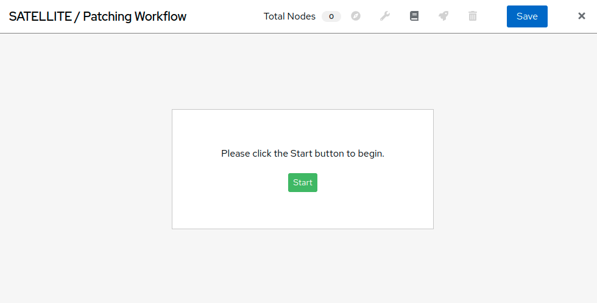
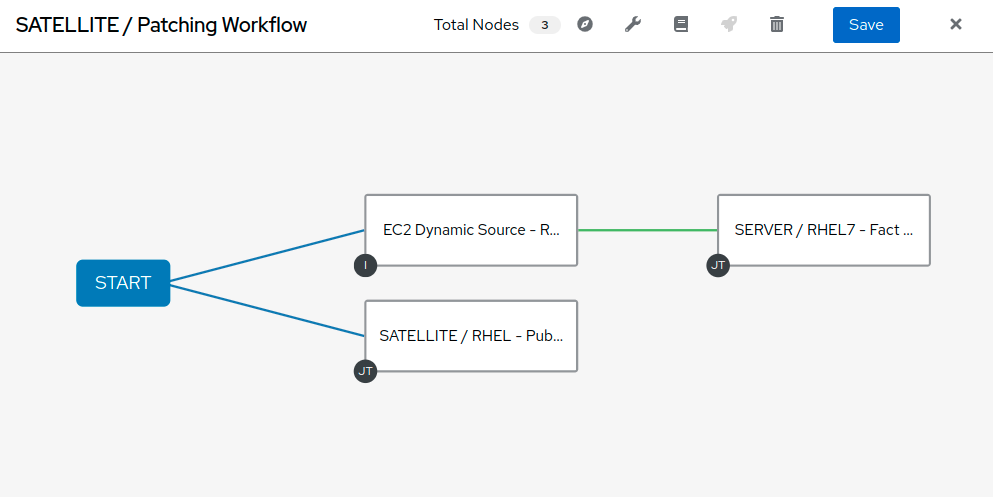
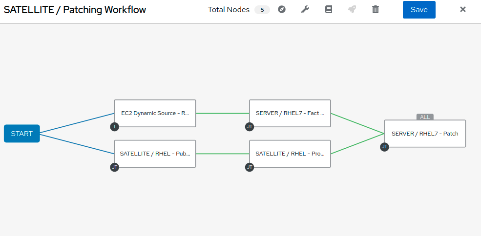
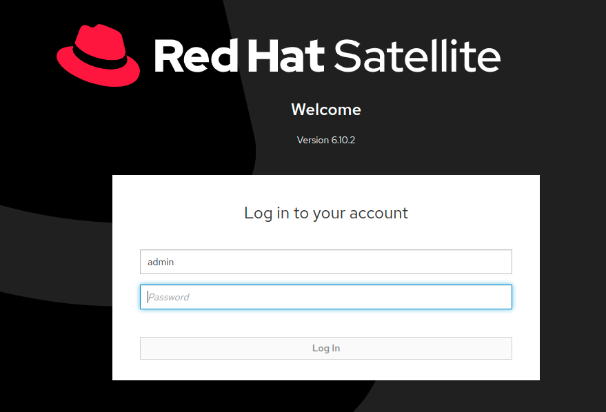
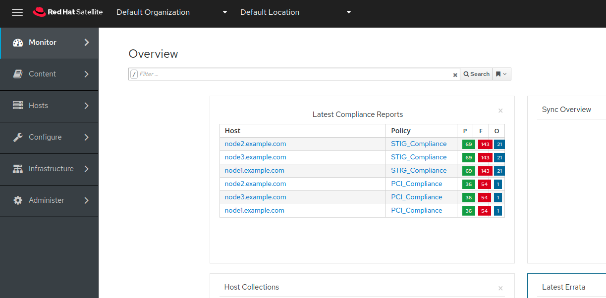
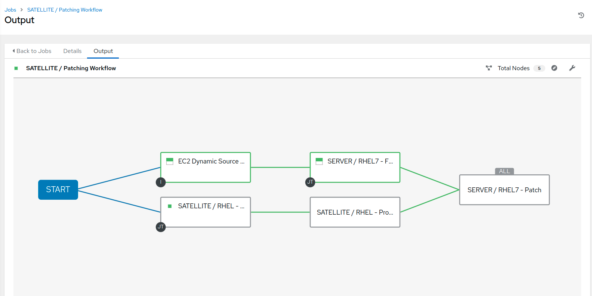
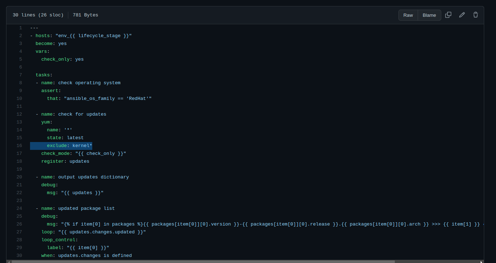

Atelier Automated Smart Management  : Automatisation de la gestion des correctifs
================================================================

**Lisez ceci dans d'autres langues**:
  [English](README.md),  [Française](README.fr.md).
 

Dans cette partie de l'atelier, nous apprendrons comment utiliser des workflows dans Ansible Automation Platform pour orchestrer la gestion de correctifs pour plusieurs serveurs linux. Automatiser la gestion des correctifs réduit les erreurs humaines et améliore la configuration et la précision des correctifs. En outre, l'automatisation fournit des capacités pour réduire l'entrée manuelle associée aux systèmes d'identification, de test et de patching. L'utilisation de la plateforme Ansible Automation permet des scénarios de gestion de correctifs plus complexe.

Environnement
-----------

- Satellite 6.x, Ansible Automation Platform 2.x

- 3 clients Red Hat Enterprise Linux v7.9

Préalables
--------------

- Exercice 0 : Lab de configuration

- Organisation à utiliser = Organisation par défaut

- Lieu à utiliser = Lieu par défaut

- Content View = RHEL7

- Environnements de cycle de vie = Dev, QA, Prod

Exercice
--------

#### 1\. Se connecter à la plate-forme d'automatisation Ansible

- Utilisez un navigateur web sur votre ordinateur pour accéder à l'interface utilisateur Ansible Automation Platform. 

- Une fois dans la plateforme d'automatisation, vous pourrez voir un tableau de bord

#### 2\. Création d'un nouveau flux de travail de gestion de correctif

Maintenant, nous allons commencer à configurer un workflow qui comprend la publication d'un Content View, sa promotion, une analyse de faits, ainsi que le mise en application des correctifs de sécurité. L'objectif est de publier un nouveau Content View et de promouvoir notre environnement rhel7_DEV à QA.

- Commencez en cliquant sur "Templates" dans le menu à gauche, puis cliquez sur le bouton "Add" et choisissez "Add workflow template".

- Inscrire le nom "SATELLITE / Patching Workflow" et cliquez sur Save (il n'y a pas d'autres options nécessaires à sélectionner sur cette page).

- Cela devrait ouvrir un flux de travail vierge, offrant de commencer à le construire en choisissant le bouton vert Start. Vous pouvez toujours revenir à ce flux de travail à partir de template en sélectionnant l'onglet 'Visualizer'.

- Sélectionnez Start pour ajouter un noeud. Dans le menu déroulant "Node Type" sélectionnez "Inventory Source Sync" et cliquez sur "EC2 Dynamic Source - RHEL7 Development". Ceci établit l'inventaire que vous utiliserez dans votre flux de travail. Cliquez sur 'Save'.

- Séléctionner Start de nouveau et ajouter un second noeud (Cliquez sur l'affiche "+"). Dans le menu déroulant "Node Type" sélectionnez "Job Template" puis sélectionnez "SATELLITE / RHEL - Publish Content View". Laissez "Convergence" sur "Any". Cliquez sur Next - un formulaire est joint à cette template, vous aurez besoin de sélectionner le bon content view pour les serveurs que nous allons patcher. Sélectionnez le contente view 'RHEL7' et cliquez sur 'next'. Vous devrez alors confirmer l'aperçu de ce noeud de workflow en cliquant sur 'Save':

Cette étape dans le workflow ajoute votre première Job Template qui exécute un playbook appelé 'satellite_publish.yml'.

- Ajouter le troisième noeud au flux de travail en survolant votre nœud d'inventaire 'EC2 Dynamic Source - RHEL7 Development' et sélectionnez l'icône + pour générer un autre noeud de workflow. Dans la fenêtre pop-up, sélectionnez 'On Success', puis Suivant. Dans la fenêtre de suivi, Node Type sera 'Job Template'. Sélectionnez 'SERVER / RHEL7 - Fact Scan', laissez 'Convergence' à 'Any' et sélectionnez Suivant. Cette étape dans le workflow analysera les noeuds dans notre inventaire satellite pour vérifier les mises à jour des paquets et errata. Vous n'avez pas besoin de limiter la job template, alors cliquez sur Suivant, puis Enregistrer pour terminer la configuration.

À ce stade, votre flux de travail devrait ressembler à ce qui suit:

- Il y a deux autres noeuds à ajouter à ce flux de travail. Sur le noeud 'SATELLITE / RHEL - Publish Content View' cliquez sur l'icône +. Dans la fenêtre pop-up, sélectionnez 'On Success' et ensuite Suivant. Ajoutez la job template 'SATELLITE / RHEL - Promote Content View' et laissez 'Convergence' à 'Any' à nouveau. Il y a un formulaire qui nécessite des variables pour le Content View, l'environnement actuel du cycle de vie et l'environnement du cycle de vie suivant. Aux fins de ce laboratoire, nous allons promouvoir Dev à QA.

- Sélectionnez RHEL7 pour 'Content View '

- Sélectionnez RHEL7_Dev pour 'Current Lifecycle Environment '

- Sélectionnez RHEL7_QA pour 'Next Lifecycle Environment '

Cliquez sur Next et sur Save. 

- Ajouter le dernier noeud en survolant 'SATELLITE / RHEL- Promote Content View' et en sélectionnant l'icône +. Dans la fenêtre pop-up, sélectionnez 'On Success', puis Suivant. Ajoutez la job template 'SERVER / RHEL7 - Patch', laissez 'Convergence' à 'Any' à nouveau et sélectionnez Next. Cete template à également un formulaire joint. Vous devrez sélectionner dans la liste déroulante 'Select Environment' l'environnement que vous aimeriez patcher. Choisissez 'RHEL7_Dev'. La liste déroulante 'Check' est une sélection qui indique à server_patch.yml s'il faut ou non appliquer les mises à jour aux serveurs de notre inventaire. Comme nous voulons appliquer les correctifs, nous allons sélectionner 'No'. Cliquez sur 'Next' en bas de la fenêtre et cliquez sur 'Save'.

- Avant de pouvoir terminer le workflow, nous devons relier 'SERVER / RHEL7 - Fact Scan' à 'SERVER / RHEL7 - Patch' sur un succès. Passez sur 'SERVER / RHEL7 - Fact Scan' et cliquez sur l'icône de la chaîne. Cliquez ensuite sur la droite du nœud 'SERVER / RHEL7 - Patch' pour lier. Une nouvelle fenêtre vous permettera de choisir 'On Success'. Cliquez sur 'Save'. Vous devrez ensuite cliquer sur le bouton 'SERVER / RHEL7 - Patch', modifier le noeud et sélectionner 'ALL' depuis le menu deroulant CONVERGENCE. Continuer avec Next, Next et Save.

Votre workflow devrait ressembler à ce qui suit :

Vous pouvez maintenant sauvegarder et sortir du modèle de workflow.

#### 3\. Se connecter à Satellite

- Utilisez un navigateur web sur votre ordinateur pour accéder à l'interface Satellite

- Une fois dans Satellite, vous pourrez voir un tableau de bord.

#### 4\. Exploration de la configuration de l'hôte Satellite

- Passez la souris sur "Hosts" et sélectionnez 'Content Hosts'. Observer les correction de bugs, améliorations et mises à jour de paquets disponibles pour chaque serveur, qui variera selon la date de l'atelier. De plus, prenez note de l'environnement du cycle de vie.

- Naviguez sur 'Content' et sélectionnez 'Content Views'. Puisque les serveurs avec lesquels nous travaillons sont RHEL7 sélectionnez la vue sur le contenu RHEL7. Afin de rendre des nouveaux correctifs disponible avec Satellite, il faut publier une nouvelle version du Content View, mais nous l'avons configuré dans le cadre de notre flux de travail ! (Remarque : votre version du content view peut différer de cet exemple, c'est normal).

- Cliquez sur 'Content' puis 'Content Views' et sélectionnez RHEL7. Remarquez la nouvelle version du content view.

- Naviguez sur Hosts > All Hosts et selectionnez node1.example.com. Sélectionnez l'onglet « content » sous Détails. C'est votre nombre d'errata avant d'exécuter votre flux de travail de patch.

#### 5\. Allez sur Ansible Automation Platform et lancez le workflow de patch

- Cliquez sur Templates et chercher la job template 'SATELLITE / Patching Workflow'. Vous pouvez soit cliquer sur la fusée à droite de la template, soit sélectionner la template et sélectionner LAUNCH.

- Observez le démarrage de la tâche dans Ansible. Vous devez attendre que ce flux de travail se termine avant de passer à l'étape suivante. Ce workflow devrait prendre ~ 6 minutes pour terminer. Observez les boîtes vertes qui s'étendent et se contractent dans chacun des nœuds de flux de travail. La case du nœud devient verte lorsque l'étape est terminée - vous pouvez également passer la souris sur un nœud de flux de travail pour voir son statut.

#### 6\. Alelz dans Satellite pour voir le résultat

- Cliquez sur 'Content' puis 'Content Views' et sélectionnez RHEL7. Remarquez la nouvelle version du content view.

- Naviguez vers Hosts > All Hosts et selectionnez node1.example.com. Sélectionnez l'onglet « content » sous Détails. Notez que les errata installables ont diminué. Cela indique que nous avons appliqué nos mises à jour.

- Vous pouvez remarquer que tous les problèmes ne sont pas résolus. C'est pour montrer que vous pouvez exclure des mises à jour en fonction du type. Dans ce cas, nous n'avons pas appliquer les mises à jour du kernel. Ceci peut bien sûr être configuré en utilisant le module yum dans le playbook server_patch.yml

#### 7\. Fin du laboratoire

- Félicitions, vou avez terminé le laboratoire ! 
- Continuer à [Exercice 3: CentOS/RHEL migration et mise à niveau](../3-convert2rhel/README.fr.md), OU [Retour à la page principale de l'atelier](../README.fr.md)
